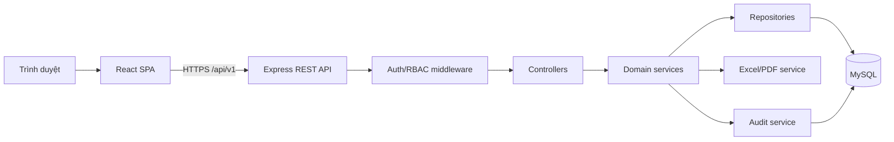
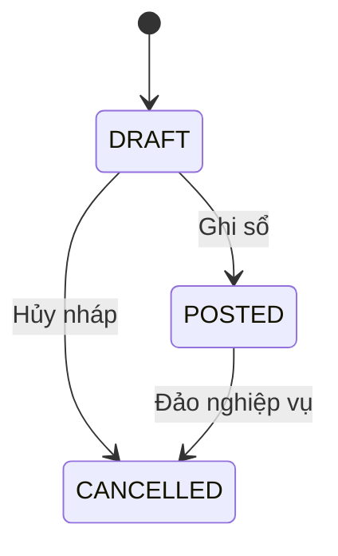
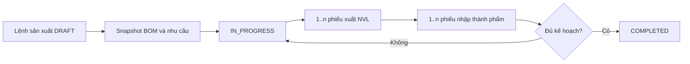

# Thiết kế tổng thể Challenge ERP

> Tài liệu phân tích và thiết kế giai đoạn 1 theo `promt.md`.
>
> Phiên bản: 1.0 — ngày 27/08/2026.

## 1. Tóm tắt cách hiểu yêu cầu

Challenge ERP là hệ thống quản trị cho doanh nghiệp sản xuất kết hợp thương mại. Hệ thống phải quản lý xuyên suốt từ danh mục, mua hàng, bán hàng, kho, công nợ đến sản xuất, lắp ráp, tháo dỡ và báo cáo.

Các nguyên tắc nghiệp vụ cốt lõi:

1. Chứng từ là nguồn phát sinh nghiệp vụ; không cập nhật trực tiếp tồn kho hoặc tổng công nợ.
2. Chứng từ `DRAFT` không ảnh hưởng sổ kho và công nợ.
3. Chỉ chứng từ `POSTED` mới tạo giao dịch kho/công nợ.
4. Hủy chứng từ đã ghi sổ phải tạo thao tác đảo, không xóa cứng.
5. Mọi nghiệp vụ tác động nhiều bảng phải chạy trong database transaction.
6. Tồn kho quản lý theo cặp hàng hóa–kho; số lượng hỗ trợ thập phân.
7. Công nợ được tổng hợp từ sổ phát sinh và phân bổ thanh toán.
8. Tiền phải dùng `DECIMAL`, không dùng số thực dấu phẩy động trong database.
9. Backend kiểm tra quyền độc lập; ẩn nút ở frontend không được coi là kiểm soát quyền.
10. Dữ liệu đã phát sinh chứng từ được soft-delete/ngừng sử dụng, không xóa cứng.

### 1.1 Phạm vi chức năng

- Xác thực, người dùng, vai trò và quyền chi tiết theo hành động.
- Dashboard tài chính–vận hành từ dữ liệu thực.
- Khách hàng, nhà cung cấp, kho, đơn vị tính, hàng hóa, bảng giá và BOM.
- Mua hàng, nhập kho tự động, thanh toán và phải trả.
- Bán hàng, xuất kho tự động, khuyến mãi, trả hàng và phải thu.
- Nhập, xuất, chuyển kho, kiểm kê và sổ kho.
- Sản xuất nhiều đầu ra, định mức kế hoạch/thực tế.
- Lắp ráp và tháo dỡ.
- Báo cáo, Excel/PDF, nhật ký hệ thống và cài đặt.

### 1.2 Trạng thái hiện tại

Ứng dụng hiện dùng React/Vite/TypeScript/Tailwind, Express/TypeScript, MySQL, JWT và Fetch API. Các vertical slice đang có gồm mua hàng–nhập kho–phải trả, đơn hàng–xuất bán–phải thu, chuyển kho, kiểm kê và sản xuất cơ bản.

Khoảng cách quan trọng so với kiến trúc đích:

- Backend còn tập trung trong `server.ts`, chưa tách controller/service/repository.
- Chưa có `/api/v1`, Swagger, refresh token, rate limit và response envelope thống nhất.
- Role đang là chuỗi cố định, chưa có bảng role/permission và permission theo hành động.
- Migration đang chạy trong startup thay vì migration versioned.
- Nhiều cột tiền đang dùng `DOUBLE` thay vì `DECIMAL`.
- Chứng từ kho cũ cập nhật balance ngay, chưa chuẩn hóa `DRAFT/POSTED/CANCELLED` và reversal.
- Chưa có soft delete, branch, khóa kỳ và optimistic concurrency.
- Frontend chưa có React Router, Query cache, form schema dùng chung và module boundaries.

Việc chuyển đổi phải theo kiểu strangler pattern: xây module mới bên cạnh API cũ, backfill dữ liệu, chuyển UI theo từng module rồi mới loại bỏ code cũ.

## 2. Kiến trúc tổng thể

### 2.1 Mô hình triển khai



Đây là modular monolith, phù hợp quy mô code hiện tại và đảm bảo transaction xuyên module. Không tách microservice trước khi có nhu cầu scale/ownership rõ ràng.

### 2.2 Backend layers

- **Route**: khai báo URL, middleware, OpenAPI annotations.
- **Controller**: parse request, gọi service, map response; không chứa nghiệp vụ.
- **Schema**: Zod validation cho params/query/body.
- **Service**: quy tắc nghiệp vụ, state transition và transaction boundary.
- **Repository**: truy vấn dữ liệu, khóa `FOR UPDATE`, mapping model.
- **Policy**: kiểm tra permission và phạm vi branch.
- **Infrastructure**: database, JWT, Excel, PDF, logger, clock, code generator.

### 2.3 Frontend layers

- `app`: router, providers, auth bootstrap, error boundary.
- `features`: module nghiệp vụ độc lập.
- `components`: modal, table, form controls, status badge dùng chung.
- `services`: HTTP client, token refresh, API types.
- `schemas`: validation schema chia sẻ trong frontend.
- `hooks`: permission, query filters và document actions.

### 2.4 Quy tắc transaction và concurrency

- Mỗi thao tác `post`, `cancel`, `receive`, `pay`, `complete` có một transaction riêng.
- Lock chứng từ và balance liên quan bằng `SELECT ... FOR UPDATE`.
- Chứng từ có `version` tăng sau mỗi cập nhật; update dùng `WHERE id=? AND version=?`.
- Unique index chống tạo liên kết nguồn trùng, ví dụ `(source_type, source_id, link_type)`.
- Idempotency key được hỗ trợ cho POST nghiệp vụ quan trọng.

### 2.5 API convention

```json
{
  "success": true,
  "message": "Thao tác thành công",
  "data": {},
  "meta": {
    "page": 1,
    "limit": 20,
    "total": 100,
    "totalPages": 5
  }
}
```

- Base URL: `/api/v1`.
- Error có `code`, `message`, `fieldErrors`, `requestId`.
- Date API dùng ISO-8601; UI hiển thị `dd/MM/yyyy`.
- Amount truyền dưới dạng decimal string ở boundary nếu cần giữ chính xác tuyệt đối.
- Danh sách dùng `page`, `limit`, `sort`, filter whitelist.

## 3. Cấu trúc thư mục đề xuất

```text
warehouse-oms/
├─ apps/
│  ├─ web/
│  │  ├─ src/
│  │  │  ├─ app/
│  │  │  │  ├─ router.tsx
│  │  │  │  ├─ providers.tsx
│  │  │  │  └─ routes/
│  │  │  ├─ components/
│  │  │  │  ├─ data-table/
│  │  │  │  ├─ dialogs/
│  │  │  │  └─ forms/
│  │  │  ├─ features/
│  │  │  │  ├─ auth/
│  │  │  │  ├─ dashboard/
│  │  │  │  ├─ partners/
│  │  │  │  ├─ items/
│  │  │  │  ├─ purchasing/
│  │  │  │  ├─ sales/
│  │  │  │  ├─ inventory/
│  │  │  │  ├─ debt/
│  │  │  │  ├─ production/
│  │  │  │  ├─ assembly/
│  │  │  │  └─ reports/
│  │  │  ├─ lib/
│  │  │  └─ styles/
│  │  └─ vite.config.ts
│  └─ api/
│     ├─ src/
│     │  ├─ app.ts
│     │  ├─ server.ts
│     │  ├─ config/
│     │  ├─ common/
│     │  │  ├─ errors/
│     │  │  ├─ middleware/
│     │  │  ├─ validation/
│     │  │  └─ audit/
│     │  ├─ modules/
│     │  │  ├─ auth/
│     │  │  ├─ iam/
│     │  │  ├─ partners/
│     │  │  ├─ catalog/
│     │  │  ├─ purchasing/
│     │  │  ├─ sales/
│     │  │  ├─ inventory/
│     │  │  ├─ debt/
│     │  │  ├─ production/
│     │  │  ├─ assembly/
│     │  │  └─ reporting/
│     │  └─ infrastructure/
│     └─ tests/
├─ packages/
│  ├─ contracts/       # DTO/schema/type dùng chung
│  ├─ database/        # ORM schema, migration, seed
│  └─ config/
├─ docs/
│  ├─ ERP_ARCHITECTURE.md
│  └─ openapi/
├─ templates/
└─ package.json
```

Trong giai đoạn chuyển đổi, `src/` và `server.ts` hiện tại vẫn chạy. Module được trích lần lượt, không move toàn bộ trong một commit.

## 4. Sitemap

```text
/login
/dashboard
/purchasing/documents
/sales/documents
/sales/returns
/partners/customers
/partners/suppliers
/catalog/items
/catalog/units
/catalog/price-lists
/catalog/boms
/inventory/receipts
/inventory/issues
/inventory/transfers
/inventory/stocktakes
/production/orders
/assembly/orders
/disassembly/orders
/debt/receivables
/debt/payables
/debt/receipts
/debt/vouchers
/promotions
/reports/inventory-summary
/reports/item-ledger
/reports/sales
/reports/profit
/reports/debt-aging
/reports/production
/settings/system
/settings/warehouses
/iam/users
/iam/roles
/audit-logs
```

## 5. ERD mục tiêu

ERD dưới đây tập trung vào quan hệ nghiệp vụ chính. Các bảng đều có audit columns và soft delete theo phần 6.

```mermaid
erDiagram
    USERS ||--o{ USER_ROLES : has
    ROLES ||--o{ USER_ROLES : assigned
    ROLES ||--o{ ROLE_PERMISSIONS : grants
    PERMISSIONS ||--o{ ROLE_PERMISSIONS : contains
    BRANCHES ||--o{ WAREHOUSES : owns

    ITEM_CATEGORIES ||--o{ ITEMS : classifies
    UNITS ||--o{ ITEMS : primary_unit
    ITEMS ||--o{ UNIT_CONVERSIONS : converts
    ITEMS ||--o{ ITEM_PRICES : priced
    ITEMS ||--o{ ITEM_BARCODES : barcodes
    WAREHOUSES ||--o{ INVENTORY_BALANCES : stores
    ITEMS ||--o{ INVENTORY_BALANCES : balanced

    ITEMS ||--o{ BOM_HEADERS : output
    BOM_HEADERS ||--o{ BOM_LINES : contains
    ITEMS ||--o{ BOM_LINES : component

    SUPPLIERS ||--o{ PURCHASE_DOCUMENTS : vendor
    PURCHASE_DOCUMENTS ||--|{ PURCHASE_DOCUMENT_LINES : contains
    PURCHASE_DOCUMENTS ||--o{ PURCHASE_DOCUMENT_LINKS : links
    PURCHASE_DOCUMENTS ||--o{ PAYABLE_TRANSACTIONS : creates

    CUSTOMERS ||--o{ SALES_DOCUMENTS : buyer
    SALES_DOCUMENTS ||--|{ SALES_DOCUMENT_LINES : contains
    SALES_DOCUMENTS ||--o{ SALES_RETURNS : returned_from
    SALES_RETURNS ||--|{ SALES_RETURN_LINES : contains
    SALES_DOCUMENTS ||--o{ RECEIVABLE_TRANSACTIONS : creates

    PROMOTION_PROGRAMS ||--|{ PROMOTION_CONDITIONS : has
    PROMOTION_PROGRAMS ||--|{ PROMOTION_REWARDS : gives
    PROMOTION_PROGRAMS ||--o{ PROMOTION_USAGE_LOGS : applied

    INVENTORY_DOCUMENTS ||--|{ INVENTORY_DOCUMENT_LINES : contains
    INVENTORY_DOCUMENTS ||--o{ INVENTORY_TRANSACTIONS : posts
    ITEMS ||--o{ INVENTORY_TRANSACTIONS : moved
    WAREHOUSES ||--o{ INVENTORY_TRANSACTIONS : at
    WAREHOUSE_TRANSFERS ||--|{ WAREHOUSE_TRANSFER_LINES : contains
    STOCKTAKES ||--|{ STOCKTAKE_LINES : contains

    PRODUCTION_ORDERS ||--|{ PRODUCTION_ORDER_OUTPUTS : outputs
    PRODUCTION_ORDERS ||--|{ PRODUCTION_ORDER_MATERIALS : consumes
    PRODUCTION_ORDERS ||--o{ PRODUCTION_ORDER_DOCUMENTS : links
    ASSEMBLY_ORDERS ||--|{ ASSEMBLY_ORDER_LINES : consumes
    DISASSEMBLY_ORDERS ||--|{ DISASSEMBLY_ORDER_LINES : recovers

    PAYMENT_RECEIPTS ||--|{ PAYMENT_RECEIPT_ALLOCATIONS : allocates
    RECEIVABLE_TRANSACTIONS ||--o{ PAYMENT_RECEIPT_ALLOCATIONS : settled
    PAYMENT_VOUCHERS ||--|{ PAYMENT_VOUCHER_ALLOCATIONS : allocates
    PAYABLE_TRANSACTIONS ||--o{ PAYMENT_VOUCHER_ALLOCATIONS : settled
```



## 6. Danh sách bảng và quan hệ

### 6.1 Audit columns chuẩn

Mọi master/transaction table phù hợp có:

- `id BIGINT`.
- `branch_id BIGINT NULL`.
- `created_at DATETIME(3)`, `created_by BIGINT`.
- `updated_at DATETIME(3)`, `updated_by BIGINT`.
- `deleted_at DATETIME(3) NULL`, `deleted_by BIGINT NULL`.
- `version INT NOT NULL DEFAULT 1`.

### 6.2 Hệ thống

| Bảng | Mục đích | Quan hệ chính |
|---|---|---|
| `users` | Tài khoản | N-N roles |
| `roles` | Vai trò | N-N permissions |
| `permissions` | Quyền `resource.action` | role_permissions |
| `user_roles` | Gán vai trò | user, role, branch |
| `role_permissions` | Gán quyền | role, permission |
| `refresh_tokens` | Refresh token rotate/revoke | user |
| `branches` | Chi nhánh | warehouses, documents |
| `system_settings` | Thiết lập VAT, rounding, negative stock | scoped key/value |
| `accounting_periods` | Kỳ và trạng thái khóa | branch |
| `audit_logs` | Nhật ký bất biến | actor, entity, before/after |

### 6.3 Danh mục

| Bảng | Mục đích |
|---|---|
| `warehouses` | Kho theo chi nhánh, unique code |
| `units` | Đơn vị tính |
| `unit_conversions` | Quy đổi đơn vị theo item |
| `item_categories` | Cây nhóm hàng |
| `items` | Danh mục dùng chung; các capability flags |
| `item_prices` | Giá mua/bán theo price list và hiệu lực |
| `item_barcodes` | Nhiều mã vạch/item/unit |
| `customers`, `customer_groups` | Khách hàng và nhóm |
| `suppliers`, `supplier_groups` | Nhà cung cấp và nhóm |
| `employees` | Nhân viên nghiệp vụ |
| `bank_accounts` | Tài khoản thanh toán |

`items` không lưu số tồn. `inventory_balances` là projection cache có thể tái dựng từ ledger.

### 6.4 BOM

- `bom_headers`: item đầu ra, version, effective dates, standard output quantity, loss rate, status.
- `bom_lines`: component item, unit, default warehouse, quantity, loss rate.
- `assembly_bom_headers`, `assembly_bom_lines`: BOM đóng gói/lắp ráp tách khỏi BOM sản xuất.

### 6.5 Mua hàng

- `purchase_documents`: header, supplier, dates, invoice, payment/document status, totals.
- `purchase_document_lines`: item/unit/warehouse, qty, price, discount, VAT, allocated cost, inventory value.
- `purchase_document_links`: liên kết receipt/payment/source, unique chống lặp.
- Phát sinh `payable_transactions` khi post; payment nằm trong module debt.

### 6.6 Bán hàng và khuyến mãi

- `sales_documents`, `sales_document_lines`: dòng có type `SALE/PROMOTION/NOTE`.
- `sales_returns`, `sales_return_lines`: tham chiếu dòng bán gốc và theo dõi returned quantity.
- `sales_document_links`: shipment/payment/return links.
- `promotion_programs`, `promotion_conditions`, `promotion_rewards`, `promotion_customer_groups`, `promotion_usage_logs`.

### 6.7 Kho

- `inventory_documents`: header chung cho receipt/issue/adjustment.
- `inventory_document_lines`: item, warehouse, qty, unit cost/value.
- `inventory_transactions`: immutable ledger; reversal tham chiếu transaction gốc.
- `inventory_balances`: projection `(warehouse_id,item_id)`.
- `warehouse_transfers`, `warehouse_transfer_lines`: requested/shipped/received quantities.
- `stocktakes`, `stocktake_lines`: book/actual/difference và adjustment links.

### 6.8 Sản xuất/lắp ráp

- `production_orders`: trạng thái và kế hoạch.
- `production_order_outputs`: hỗ trợ nhiều mã thành phẩm.
- `production_order_materials`: snapshot định mức tại thời điểm lập lệnh.
- `production_order_documents`: nhiều issue/receipt mỗi lệnh.
- `assembly_orders`, `assembly_order_lines`.
- `disassembly_orders`, `disassembly_order_lines`.

### 6.9 Công nợ

- `receivable_transactions`, `payable_transactions`: ledger debit/credit theo đối tác và source.
- `payment_receipts`, `payment_vouchers`: chứng từ thu/chi.
- `payment_receipt_allocations`, `payment_voucher_allocations`: phân bổ N-N giữa thanh toán và hóa đơn.

## 7. Luồng mua hàng → nhập kho → công nợ



### 7.1 Lưu nháp

1. Validate header/lines, duplicate code và kỳ khóa.
2. Tính totals bằng decimal service.
3. Lưu purchase document `DRAFT`.
4. Không tạo inventory/payable transaction.

### 7.2 Ghi sổ

1. Lock document, xác nhận `DRAFT`, version và quyền `purchase.post`.
2. Revalidate supplier, items, warehouse, period và totals.
3. Chuyển document sang `POSTED`.
4. Nếu nhập kho: tạo receipt `POSTED`, inventory ledger và update projection balance.
5. Ghi payable transaction cho tổng thanh toán.
6. Nếu trả ngay: tạo payment voucher và allocation; balance còn lại bằng 0.
7. Lưu links và audit trong cùng transaction.

### 7.3 Hủy

1. Lock source và linked documents.
2. Từ chối nếu kỳ khóa hoặc link không thể đảo.
3. Tạo reversal inventory transactions.
4. Tạo payable reversal và hủy allocation phù hợp.
5. Đánh dấu source/linked documents `CANCELLED`, không delete.

## 8. Luồng bán hàng → xuất kho → công nợ

1. Lưu nháp chứng từ bán và promotion snapshot; chưa giữ/trừ tồn tùy quyết định reservation.
2. Khi post: lock tồn từng item–warehouse theo thứ tự cố định để tránh deadlock.
3. Kiểm tra available stock cho cả hàng bán và hàng tặng.
4. Tạo sales document `POSTED`.
5. Tạo inventory issue và giảm balance.
6. Snapshot unit cost; ghi COGS và gross profit.
7. Tạo receivable transaction.
8. Nếu thu ngay: tạo receipt và allocation.
9. Lưu promotion usage và document links.

Trả hàng:

1. Chọn sales line gốc, tính `sold - previous returns`.
2. Validate returned quantity và kho nhận.
3. Tạo sales return `POSTED`, receipt kho loại `SALES_RETURN`.
4. Đảo doanh thu/thuế/giá vốn theo snapshot gốc.
5. Tạo receivable credit; hoàn tiền chỉ khi credit vượt dư nợ được đối trừ.

## 9. Luồng sản xuất



1. Một lệnh có nhiều output.
2. Nhu cầu component được tổng hợp theo tất cả output và BOM version có hiệu lực.
3. Snapshot material lines để BOM thay đổi không sửa lịch sử.
4. Cho xuất nhiều lần, theo dõi planned/issued/remaining.
5. Cho nhập nhiều lần, theo dõi planned/received.
6. Hoàn thành thiếu cần permission riêng và lý do.
7. Hủy yêu cầu đảo linked warehouse documents trước.

## 10. Luồng lắp ráp và tháo dỡ

### 10.1 Lắp ráp

1. Chọn thành phẩm, số lượng, kho linh kiện và kho nhập.
2. Load assembly BOM version và snapshot lines.
3. Tính component demand, cảnh báo thiếu.
4. Post tạo issue linh kiện và receipt thành phẩm trong một transaction.
5. Cost thành phẩm = tổng cost linh kiện + chi phí lắp ráp, phân bổ theo output quantity.

Ví dụ: 20 CLC2818 × 18 CLC28PA = 360 CLC28PA, cộng các vật tư đóng gói trong BOM.

### 10.2 Tháo dỡ

1. Chọn thành phẩm nguồn, qty, kho xuất và kho thu hồi.
2. Xuất thành phẩm theo cost hiện tại.
3. Nhập component thực tế thu hồi; ghi hao hụt/hỏng.
4. Phân bổ tổng giá trị thành phẩm cho component theo tỷ lệ cấu hình hoặc giá trị tương đối.
5. Issue và receipts được post nguyên tử.

## 11. Danh sách REST API mục tiêu

Mọi endpoint dưới `/api/v1`, dùng auth trừ login/refresh.

### 11.1 Auth và IAM

| Method | Endpoint | Permission |
|---|---|---|
| POST | `/auth/login` | public |
| POST | `/auth/refresh` | refresh token |
| POST | `/auth/logout` | authenticated |
| GET/POST | `/users` | `user.view/create` |
| PATCH | `/users/:id` | `user.update` |
| GET/POST | `/roles` | `role.view/create` |
| PUT | `/roles/:id/permissions` | `role.assign_permission` |

### 11.2 Danh mục

- CRUD `/branches`, `/warehouses`, `/units`, `/item-categories`, `/items`.
- `/items/:id/prices`, `/items/:id/barcodes`, `/items/:id/stock-card`.
- `/items/import/template`, `/items/import/preview`, `/items/import/commit`, `/items/export`.
- CRUD `/customers`, `/suppliers`; detail debt/history/payment endpoints.
- CRUD `/boms`, `/assembly-boms`; activate/version endpoints.

### 11.3 Mua hàng

- `GET/POST /purchase-documents`.
- `GET/PATCH /purchase-documents/:id`.
- `POST /purchase-documents/:id/post`.
- `POST /purchase-documents/:id/cancel`.
- `POST /purchase-documents/:id/clone`.
- `GET /purchase-documents/:id/links`.
- `GET /purchase-documents/export`.

### 11.4 Bán hàng và khuyến mãi

- CRUD/list/post/cancel/clone `/sales-documents`.
- `POST /sales-documents/preview-promotions`.
- CRUD `/promotions`; activate/deactivate endpoints.
- `GET/POST /sales-returns`; `POST /sales-returns/:id/post|cancel`.

### 11.5 Kho

- List/create/update `/inventory-receipts`, `/inventory-issues`.
- `POST /inventory-documents/:id/post|cancel`.
- `GET /inventory/balances`, `/inventory/availability`, `/inventory/ledger`.
- CRUD/list `/warehouse-transfers`; `post-shipment`, `confirm-receipt`, `cancel`.
- CRUD/list `/stocktakes`; `load-book-stock`, `approve`, `cancel`.

### 11.6 Công nợ

- `GET /receivables`, `/payables`, `/debt-aging`.
- CRUD `/payment-receipts`, `/payment-vouchers`.
- `POST /payment-receipts/:id/post|cancel`.
- `POST /payment-vouchers/:id/post|cancel`.
- Allocation preview/commit endpoints.

### 11.7 Sản xuất

- CRUD/list `/production-orders`; `calculate-materials`, `start`, `pause`, `complete`, `cancel`.
- `POST /production-orders/:id/material-issues`.
- `POST /production-orders/:id/output-receipts`.
- CRUD/list/post/cancel `/assembly-orders`, `/disassembly-orders`.

### 11.8 Dashboard, report, audit

- `GET /dashboard?from&to&branchId&warehouseId`.
- `GET /reports/inventory-summary`, `/reports/item-ledger`, `/reports/sales`, `/reports/profit`, `/reports/debt-aging`, `/reports/production`.
- Export endpoints dùng cùng filter và async job khi dữ liệu lớn.
- `GET /audit-logs` với filter entity/actor/date/action.

## 12. Ma trận phân quyền

Ký hiệu: `V` xem, `C` tạo/sửa nháp, `P` ghi sổ/hoàn thành, `X` hủy, `E` xuất/in, `A` quản trị.

| Vai trò | Danh mục | Mua | Bán | Kho | Công nợ | Sản xuất | Báo cáo | IAM |
|---|---|---|---|---|---|---|---|---|
| Quản trị viên | A | A | A | A | A | A | A | A |
| Ban giám đốc | V | V | V | V | V | V | V/E | - |
| Kế toán mua hàng | V/C | C/P/X/E | - | V | V/C/P | V | V/E | - |
| Kế toán bán hàng | V/C | - | C/P/X/E | V | V/C/P | - | V/E | - |
| Kế toán công nợ | V | V | V | - | V/C/P/X/E | - | V/E | - |
| Nhân viên kho | V | V | V | V/C | - | V | V | - |
| Quản lý kho | V/C | V | V | V/C/P/X/E | - | V | V/E | - |
| Nhân viên sản xuất | V | - | - | V | - | V/C | V | - |
| Quản lý sản xuất | V/C | - | - | V/P | - | V/C/P/X/E | V/E | - |
| Nhân viên kinh doanh | V | - | V/C/E | V tồn | V phải thu | - | V doanh thu | - |
| Chỉ xem báo cáo | - | - | - | - | - | - | V/E | - |

Permission thực tế dùng key chi tiết, ví dụ `sales.price.override`, `inventory.negative_stock`, `period.unlock`, `cost.view`, không chỉ role-level boolean.

Role hiện tại cần mapping tạm:

- `ADMIN` → Quản trị viên.
- `W_MANAGER` → Quản lý kho.
- `P_MANAGER` → Quản lý sản xuất.
- `S_SALES` → Nhân viên/Kế toán bán hàng tùy tài khoản.
- `QD` → Ban giám đốc.

## 13. Trạng thái và quy tắc nghiệp vụ

### 13.1 Chứng từ chung

- `DRAFT`: sửa/xóa được, không tác động ledger.
- `POSTED`: bất biến về nội dung tài chính; sửa bằng hủy/đảo và lập lại.
- `CANCELLED`: tác động đã đảo, giữ lịch sử.
- `PARTIALLY_COMPLETED`, `COMPLETED`: áp dụng order/transfer/production.

### 13.2 Thanh toán

- `UNPAID`, `PARTIALLY_PAID`, `PAID`, `OVERPAID` chỉ khi nghiệp vụ cho phép credit.
- Payment status là projection từ allocations, không phải dữ liệu nhập tùy ý.

### 13.3 Chuyển kho

- `DRAFT → IN_TRANSIT → RECEIVED`.
- `DRAFT/IN_TRANSIT → CANCELLED` theo quy tắc reversal.
- Post shipment giảm kho nguồn; confirm receipt tăng kho đích.

### 13.4 Sản xuất

- `DRAFT → NOT_STARTED → IN_PROGRESS ↔ PAUSED → COMPLETED`.
- Trước completed có thể `CANCELLED` nếu linked docs đã đảo.

## 14. Kế hoạch triển khai

### Phase 1 — Hoàn thiện thiết kế

- Chốt các quyết định ở mục 15.
- Baseline schema và data mapping cũ → mới.
- Chốt API contracts, status machine, permission catalog.

### Phase 2 — Nền tảng an toàn

- Tách app bootstrap khỏi `server.ts` mà không đổi behavior.
- Thêm logger, error envelope, request ID, CORS/rate limit.
- Tạo `/api/v1`, Swagger, access/refresh token.
- ORM/migration versioned và test database riêng.
- RBAC tables/policies; giữ role cũ qua compatibility adapter.

### Phase 3 — Danh mục

- Chuẩn hóa items/capability flags, units/conversions, warehouse CRUD.
- Price lists và BOM versioning.
- Soft delete; Excel preview/import/export.

### Phase 4 — Inventory ledger

- Xây immutable inventory ledger và balance projection.
- Migrate giao dịch cũ, reconciliation report.
- Receipt/issue draft-post-cancel; transfer two-step; stocktake adjustment.

### Phase 5 — Purchase và sales

- Chuyển vertical slice mua hàng hiện hữu sang state machine/ledger mới.
- Sales posting, COGS, payment links.
- Promotion engine và sales return.

### Phase 6 — Debt

- Receivable/payable ledgers và N-N allocations.
- Thu/chi nhiều chứng từ, aging report và opening balances.

### Phase 7 — Production/assembly

- BOM snapshot, multi-output production, partial issue/receipt.
- Assembly/disassembly và costing.

### Phase 8 — Dashboard/reports

- Date/branch/warehouse filters, period comparison.
- Reports từ ledger, export jobs, PDF.

### Phase 9 — Hardening

- Unit/integration/E2E tests theo tiêu chí prompt.
- Performance indexes, security review, backup/migration rehearsal.
- Seed demo, deployment documentation và monitoring.

### Chiến lược chuyển đổi dữ liệu

1. Đóng băng schema legacy bằng snapshot migration `000_baseline`.
2. Tạo bảng mới song song; không rename bảng legacy ngay.
3. Backfill ID mapping và ledger từ transactions hiện có.
4. Chạy đối soát tồn theo item/kho và công nợ.
5. Dual-read có feature flag; tránh dual-write kéo dài.
6. Chuyển module từng phần và có rollback flag.
7. Chỉ drop legacy sau ít nhất một kỳ đối soát được duyệt.

## 15. Những điểm nghiệp vụ cần xác nhận

Các quyết định này ảnh hưởng schema hoặc số liệu, cần chốt trước phase 2–4:

1. Một user có nhiều role và nhiều chi nhánh hay chỉ một role chính?
2. `S_SALES` hiện tại là nhân viên bán hàng hay kế toán bán hàng; ai có quyền duyệt giá/đơn?
3. Có bắt buộc maker–checker: người lập không được tự duyệt/ghi sổ chứng từ?
4. Số chứng từ dùng sequence toàn công ty, theo chi nhánh hay theo năm/tháng?
5. Kỳ kế toán và ngày bắt đầu dữ liệu chính thức; ai được mở khóa kỳ?
6. Cho phép xuất âm kho ở mức hệ thống, kho, role hay từng chứng từ?
7. Tồn khả dụng có giữ hàng ngay khi đơn bán được duyệt hay chỉ khi post xuất kho?
8. Chuyển kho có bắt buộc hai bước xuất–nhận hay cho phép hoàn tất ngay với chuyển nội bộ?
9. Giá vốn khởi tạo dùng bình quân tức thời, bình quân cuối kỳ hay bình quân di động?
10. Khi trả hàng, giá vốn nhập lại dùng giá vốn trên dòng bán gốc hay giá vốn hiện tại?
11. VAT tính theo từng dòng hay tổng chứng từ; quy tắc làm tròn bao nhiêu chữ số?
12. Chi phí mua phân bổ theo giá trị, số lượng, khối lượng hay cho chọn từng chứng từ?
13. Bảng giá mặc định theo khách hàng, nhóm khách hàng hay hợp đồng; thứ tự ưu tiên?
14. Promotion có cộng dồn không; ưu tiên chương trình và giới hạn ngân sách/lượt dùng?
15. Hàng tặng có chịu VAT và doanh thu tính thuế theo quy định nào?
16. Công nợ đầu kỳ và tồn đầu kỳ sẽ import tại ngày nào, có cần chứng từ opening riêng?
17. Thanh toán thừa được giữ thành credit hay không cho vượt dư nợ?
18. Một payment có thể phân bổ chéo nhiều khách hàng/nhà cung cấp không? Khuyến nghị: không.
19. Sản xuất nhiều output phân bổ cost theo số lượng, trọng lượng hay giá trị chuẩn?
20. Hoàn thành thiếu lệnh sản xuất cần ngưỡng và role nào?
21. Tháo dỡ phân bổ giá trị component theo tỷ lệ BOM hay giá trị thị trường?
22. Cần quản lý lot/batch, hạn dùng và serial ở mức nào? Code hiện đã có batch ở sản xuất nhưng kho chưa theo lot.
23. Có quản lý nhiều tiền tệ/tỷ giá không? Prompt hiện mặc định VND.
24. Có cần hóa đơn điện tử/API kế toán ngoài hệ thống không?
25. Retention audit log, chính sách backup và RPO/RTO mong muốn?

## 16. Quyết định kỹ thuật cần xác nhận

1. Chọn Prisma hay Sequelize. Đề xuất Prisma nếu chấp nhận migration sang generated client; Sequelize nếu cần raw SQL linh hoạt và chuyển đổi ít gián đoạn hơn.
2. Chọn monorepo `apps/web + apps/api` hay giữ một package trong giai đoạn đầu. Đề xuất monorepo workspace nhưng move theo module.
3. Chọn test runner. Đề xuất Vitest cho unit/frontend và Supertest cho API integration.
4. Chọn API documentation. Đề xuất OpenAPI 3.1 generated từ Zod schemas.
5. Có cài React Router/TanStack Query/React Hook Form/Zod như prompt ngay phase 2 hay chuyển từng page? Đề xuất chuyển từng page.

## 17. Definition of Done mỗi vertical slice

- Migration up/down hoặc migration forward-only có rollback plan.
- API versioned, schema validation, permission và OpenAPI.
- Service transaction và repository tests.
- UI loading/empty/error/responsive và permission-aware.
- Audit log cho create/update/post/cancel.
- TypeScript, unit test, integration test và production build đạt.
- Không để dữ liệu test trong database production/development sau verification.
- Có reconciliation cho nghiệp vụ ảnh hưởng kho/công nợ.

## 18. Thứ tự vertical slice kế tiếp đề xuất

Vertical slice mua hàng hiện đã hoạt động nhưng chưa có draft/post/cancel chuẩn. Slice tiếp theo nên là:

`Purchase DRAFT → POSTED → inventory ledger → payable ledger → payment allocation → CANCELLED/reversal`

Lý do: đây là luồng đang có dữ liệu và integration test, giúp xây nền inventory/debt ledger dùng lại cho bán hàng, trả hàng, sản xuất và lắp ráp; rủi ro thấp hơn triển khai khuyến mãi hoặc production mới trên schema legacy.